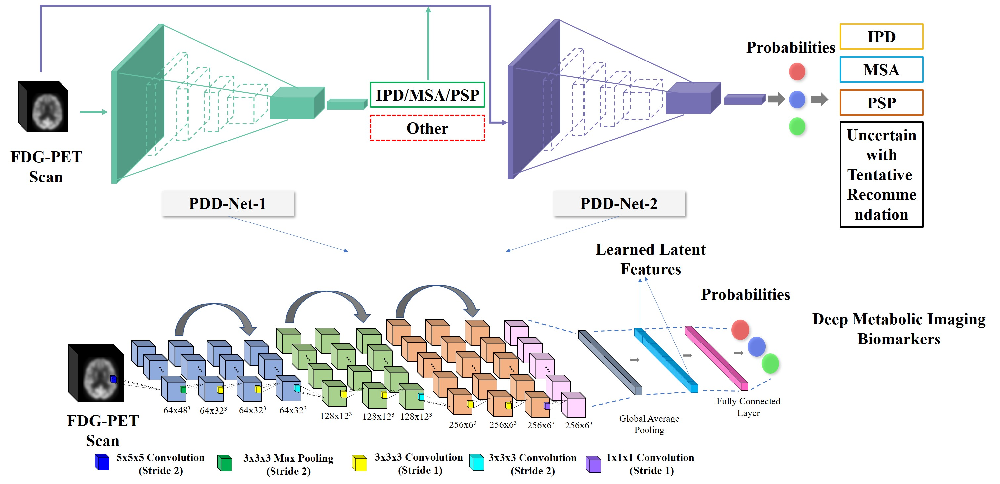
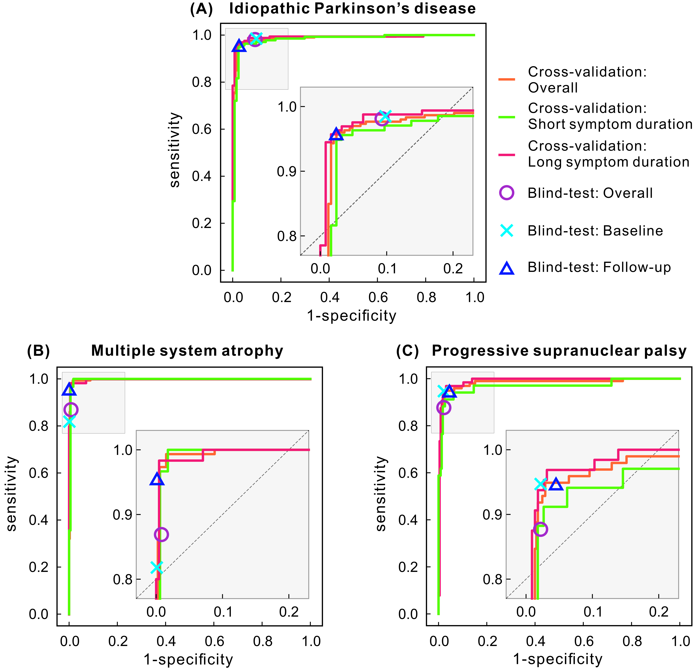

# deep-metabolic-imaging-biomarker
Code for paper titled "Differential diagnosis of parkinsonism with deep metabolic imaging biomarker" 

by Yu Zhao, University of Bern and Technical University of Munich 

last modified 07.21.2020

# A sketch of the developed deep learning methods:

A sketch of the developed deep learning methods, which has two stages i.e., control stage and classification stage. In the control stage, The Parkinson Differential Neural Network-1(PDD-Net-1) works to exclude non-parkinsonian patients. In the classification stage, the Parkinson Differential Neural Network-2 (PDD-Net-2) extracts the deep metabolic imaging (DMI) biomarker to classify idiopathic Parkinson’s disease (IPD), multiple system atrophy (MSA), and progressive supranuclear palsy (PSP).

# Performance:

The accuracy of the deep metabolic imaging (DMI) biomarker in the development phase on the training cohort and blind test phase on both Chinese and German test cohorts. The results in the cross-validation on 547 patients (Training Cohort) were plotted using receiver operating characteristic (ROC) curves. The results in the Chinese blind-test cohort were illustrated as single points, where Overall represents the results of all the tested 330 patients. 108 patients in the blind test have follow-up scans and the performance of them at Baseline and Follow-up was plotted. The blind-test results in the German cohort (90 patients) are also included and denoted with the black rectangular for easy comparison. (A) idiopathic Parkinson’s disease (IPD); (B) multiple system atrophy (MSA); (C) progressive supranuclear palsy (PSP).  Short symptom duration represents patients with symptom duration ≤ 2 years and long symptom duration means patients with symptom duration > 2 years.

# Requirement:
  > Python 2.7.3  
  > tensorflow 1.9.0  
  > Keras 2.2.2  
  > keras-contrib 2.0.8  
  > pandas 0.24.2  
  > scikit-image 0.14.0  
  > scikit-learn 0.19.2  
  > SimpleITK 1.1.0  

# Guideline for utilizing:
(1) Editor config file:

    Edit config file to assign parameters such as GPU device.

(2) Training data should be organized as:
    
    Input_directory_path:    
        /MSA
            /*.img    
        /IPD/
            /*.img       
        /PSP/
            /*.img   

(3) Data preparing    

    python prepareData.py --data_folder Input_directory_path --project_folder project_folder --image_ext '*.img' --CV_fold 6 --data_norm

(4) training the model:
    
    python train.py --project_folder project_folder --baseModeType 'resnew' --optType 'adam' --epochs 50 --CV_fold 6 --currentFold 1 --learning_rate = 0.0001

(5) Evaluated the performance of the trained model:

    python evaluate.py --project_folder project_folder --CV_fold 6 --currentFold 1

(6) predict an unseen data:

    python test.py --data_folder Input_testdata_directory_path --image_ext '*.img' --data_norm --project_folder project_folder --baseModeType 'resnew' --CV_fold 6
